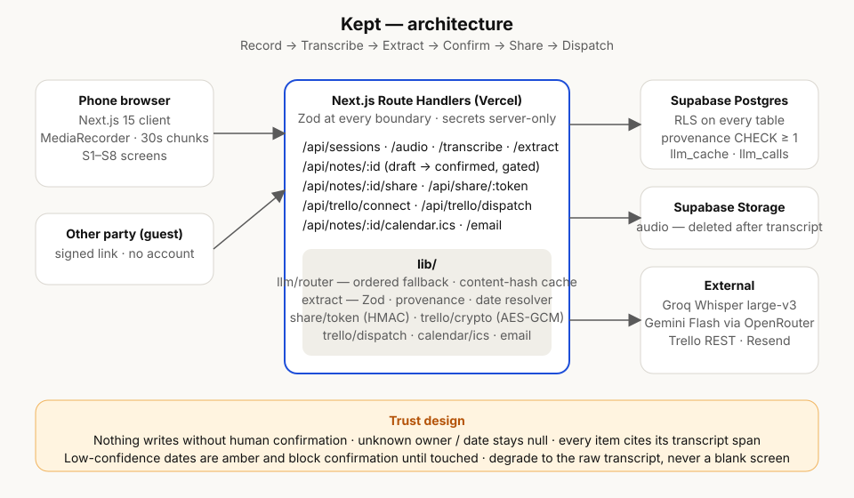

<div align="center">

# ● Kept

### *You said it. Now it's on the board.*

**Kept records a real conversation between two people and turns every spoken commitment into a tracked task — on a shared, correctable note, pushed to Trello and your calendar.**

[](https://github.com/jeelpatel24/Kept/actions/workflows/ci.yml)


*Built solo for AI Builders Hackathon 2026 by Jeel Patel*

</div>

---

## ▶ Press play

> **Ravi** (contractor, standing in unit 204, gloves off): *"I'll get Marco in to patch the drywall before the painter comes."*
> **Dana** (client): *"Painter's booked for the 12th, so by the 10th latest."*
> **Ravi:** *"Done. And I'll send you the revised tile quote by Thursday."*
> **Dana:** *"I'll get the deposit over end of next week."*

Forty seconds later, both of them have this:

| Who | Owes what | By when | Where it lives |
|---|---|---|---|
| Ravi | Patch the drywall in 204 | **Sep 10** | Trello card ↗ · calendar |
| Ravi | Send the revised tile quote | **Thu, Aug 27** | Trello card ↗ · calendar |
| Dana | Send the deposit | **Fri, Sep 4** ⚠ *confirm?* | Trello card ↗ · calendar |

Every row links back to the exact sentence in the transcript that created it. Dana got the same note on her phone, no account, with *her* items at the top. Nobody typed a thing.

---

## ⏺ The problem

Commitments die in conversation. On a job site, a client call, a vendor meeting, two people agree to things out loud and then:

- nobody writes it down, or
- one person writes *their* version, in *their* notes, that the other never sees, or
- it gets written down and never becomes a task anyone tracks.

Meeting-notes tools produce **a summary for one person**. A summary is not an agreement, and it is not a task. The gap is between *"we said it"* and *"it's on someone's board with a due date."* Kept closes that gap.

---

## ⏵ How it works

```
 ┌──────────┐   ┌────────────┐   ┌──────────┐   ┌──────────┐   ┌──────────┐   ┌──────────┐
 │  RECORD  │ → │ TRANSCRIBE │ → │ EXTRACT  │ → │ CONFIRM  │ → │  SHARE   │ → │ DISPATCH │
 │ one tap  │   │  Whisper   │   │  who ·   │   │  human   │   │ signed   │   │ Trello · │
 │ on phone │   │  large-v3  │   │  what ·  │   │  gate    │   │  link    │   │  .ics    │
 │          │   │            │   │  when    │   │          │   │          │   │          │
 └──────────┘   └────────────┘   └──────────┘   └──────────┘   └──────────┘   └──────────┘
   ~90 s            0.5 s            1.5 s        you decide     no account     one tap
```

1. **Record** in the phone browser. Consent prompt, unmistakable red screen, 20-minute cap. Audio streams up in 30-second chunks so nothing is held in memory.
2. **Transcribe** with Groq Whisper large-v3 (Gemini as fallback). The audio is deleted the moment the transcript lands.
3. **Extract** decisions, commitments (who / by when) and open questions. Relative dates — *"end of next week"* — are resolved deterministically against the recording date. Every item carries the transcript span it came from.
4. **Confirm.** Nothing is shared or sent until a human says so. Enforced server-side, not by hiding a button.
5. **Share** a signed link. The other party sees *their* items first, and can suggest a correction without signing up. You accept or reject.
6. **Dispatch.** Confirmed commitments become Trello cards (owner, verbatim quote, due date, link back to the note) and `.ics` calendar events with reminders — or a `webcal://` feed that stays in sync when things change.
7. **Follow up.** One screen shows everything still owed across every conversation — Overdue · Today · Tomorrow — with one-tap done. Opt in and a scheduled daily digest emails you what's overdue and due, calendar-reminder style. The system chases the promises so you don't have to.

---

## ⏸ What makes it different

**It's a ledger, not a summary.** Kept doesn't output "here's what was discussed." It outputs *"here is what each person owes, by when, and whether it happened."*

**Shared truth.** Both parties see the same note. Either can correct it. It is a record, not one person's version.

**Provenance.** Every Trello card links back to the exact moment in the transcript. Open a card three weeks later, click through, read the line that created it.

**It refuses to guess.** This is the part we're proudest of:

| The model was… | Kept does… |
|---|---|
| unsure who owns it | shows a **"Who?"** chip — never defaults to the recorder |
| unsure about the date | shows it in **amber** with *confirm?* — and **blocks Confirm** until you touch it |
| given no date at all | leaves it empty — never defaults to "today" |
| unable to cite the transcript | drops the item — the database literally rejects rows with no provenance (`CHECK (array_length(source_segment_ids,1) >= 1)`) |
| returning malformed JSON | gets one repair retry, then fails *visibly* with the raw transcript still on screen |

---

## ⏏ Architecture



One Next.js 15 app. Route Handlers are the API. Business logic lives in `lib/`, components only render, and every boundary is validated with Zod.

```
Phone browser ── MediaRecorder, 30 s opus chunks
      │
      ▼
Next.js Route Handlers (Vercel)
  /api/sessions · /audio · /transcribe · /extract         capture → transcript → draft note
  /api/notes/:id                                          edit · draft → confirmed (gated)
  /api/notes/:id/share · /api/share/:token                signed guest link · suggest-correction
  /api/trello/connect · /api/trello/dispatch              token exchange · idempotent cards
  /api/notes/:id/calendar.ics · /api/notes/:id/email      .ics + webcal · share email
      │
      ├── Supabase Postgres — RLS on every table, source of truth
      ├── Supabase Storage  — audio, deleted after transcription
      └── Groq · OpenRouter · Trello REST · Resend
```

**Decisions worth knowing** (full reasoning in [`docs/TRD.md`](docs/TRD.md) §2):

- **Record-then-process, not streaming.** Streaming triples complexity and adds a live failure mode on stage. Batch is reliable and takes ~2 s for 90 s of audio.
- **Context-inferred speaker labels, not diarization.** Diarization is a multi-day problem with poor accuracy on noisy two-party audio. Inference plus a one-tap correction is honest and ships.
- **`.ics` files, not Calendar OAuth.** Works with every calendar, no verification queue, no quota.
- **Provider router with an ordered fallback chain.** A 429 on one provider moves straight to the next. A single hardcoded provider is a demo-day failure waiting to happen.
- **Content-hash cache on every model call.** Re-running the same audio never re-bills. Total build spend: under $20.

---

## 🔒 Trust & safety

- **Secrets stay server-side.** Provider keys, Trello tokens (AES-256-GCM at rest, user-revocable) and the share-token HMAC secret never reach the client. `npm run check:secrets` scans the built bundle in CI.
- **Guest access never goes through RLS** — a service-role handler validates the signed, expiring, revocable token first and returns a stripped view.
- **Audio never outlives the transcript.** Deleted in the same request that persists the segments.
- **Consent is visible.** A suggested line to say out loud before recording, an unmissable recording state, and the other party always gets the note.
- **Every external call** has a timeout, a retry policy, and a typed failure path. The demo does not hang on a rate limit.

---

## ⏭ Quick start

<details>
<summary><b>1 · Supabase</b></summary>

1. Create a project. In **SQL Editor** run `supabase/migrations/0001` → `0006` in order (see `MIGRATION_LOG.md`).
2. **Authentication → Sign In / Providers → Email**: on, "Confirm email" on.
3. **Authentication → URL Configuration**: Site URL `http://localhost:3000`; add `http://localhost:3000/auth/callback` to Redirect URLs (later, add your Vercel URL too).
4. Optional but recommended — custom SMTP via Resend (`smtp.resend.com`, port 465, user `resend`, password = Resend API key), then edit the **Magic link** and **Confirm sign up** templates to
   ```html
   <a href="{{ .RedirectTo }}&token_hash={{ .TokenHash }}&type=email">Sign in</a>
   ```
   so links work when opened on a different device than the one that requested them.
5. **Project Settings → API**: copy the Project URL, `anon` key and `service_role` key.
</details>

<details>
<summary><b>2 · Providers</b></summary>

- **Groq** — API key at console.groq.com. Free tier covers Whisper generously.
- **OpenRouter** — API key + a few dollars of credit (Gemini Flash extraction is fractions of a cent per note).
- **Trello** — API key from a Power-Up at trello.com/power-ups/admin; add your app origin under *Allowed origins*.
- **Resend** (optional) — for emailing share links.
</details>

<details>
<summary><b>3 · Run</b></summary>

```bash
cp .env.example .env.local        # fill in every value
npm install
npm run dev                       # http://localhost:3000

npm test                          # 71 unit tests: date resolver fixture table, schema, tokens, crypto, ics
npm run typecheck && npm run lint
npm run build && npm run check:secrets
```

Recording from a phone needs HTTPS — deploy to Vercel (import the repo, paste in your `.env.local`, set `APP_URL` to the Vercel URL, register that URL in Supabase and Trello). Set `CRON_SECRET` and the included `vercel.json` schedules the daily reminder digest (`/api/reminders/run`, 12:00 UTC).
</details>

Full walkthrough and failure drills: [`docs/E2E-CHECKLIST.md`](docs/E2E-CHECKLIST.md).

---

## 🏁 For judges

**[3-minute evaluation path →](docs/JUDGES.md)** — a live shared note you can open with one click (no account, no mic), the three things to look for, and where the interesting code lives.

## 📸 Screenshots

| Review & confirm — the amber moment | The note — cards on the board |
|---|---|
| _`docs/screenshots/review.png`_ | _`docs/screenshots/note.png`_ |

---

## ⏹ Known limitations — on purpose

Judges trust a project that names its edges.

- **No speaker diarization.** Labels are inferred from context and always editable. A wrong name is one tap from fixed.
- **English only.** **Two people.** **20 minutes.** v1 is deliberately built for one user: the site coordinator with a phone in one hand.
- **Record-then-process.** Nothing appears while you are still talking; the note arrives seconds after you stop.
- **`.ics` / `webcal://`, not two-way Google/Outlook sync.**
- **Trello tokens expire after 30 days** (Trello's ceiling for this flow); the settings screen shows the date and offers reconnect.
- **Fallback transcription (Gemini audio)** returns estimated timestamps, so provenance jumps are approximate on that path.

Everything else — teams, CRM/Slack/Jira, live transcription, native apps, billing — is on the roadmap slide, not in the repo. See [`spec.md`](spec.md) §6.

---

## 📂 Repository

```
app/                   screens S1–S8 and Route Handlers
components/            UI only — no business logic
lib/
  audio/               chunk storage, assembly, purge
  calendar/            .ics with VALARM
  email/               Resend
  extract/             Zod schema · relative-date resolver · provenance enforcement · pipeline
  llm/                 router (fallback chain, cache, call log) · providers/groq · providers/openrouter
  notes/               note graph loader · confirm gate
  prompts/             versioned prompts (extract.v1, transcribe.v1)
  share/               HMAC tokens · share_links
  transcribe/          pipeline
  trello/              client · AES-GCM · connection · idempotent dispatch
supabase/migrations/   0001–0006, forward-only — MIGRATION_LOG.md
tests/                 vitest
docs/                  PRD · TRD · SCHEMA · UX-BRIEF · IMPLEMENTATION-PLAN · ENGINEERING · E2E-CHECKLIST
```

Every commit names the requirement it implements (`Implements: PRD-F4, TRD-3.3`). Standards in [`docs/ENGINEERING.md`](docs/ENGINEERING.md).

---

<div align="center">

**MIT** · [`LICENSE`](LICENSE) · Made in Toronto by Jeel Patel

*Commitments shouldn't die in conversation.*

</div>
